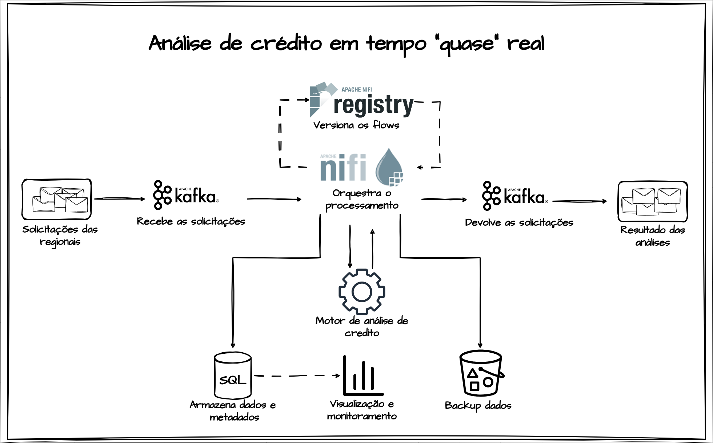

# Análise de crédito em tempo real



[](https://hub.docker.com/r/apache/nifi)
[](https://hub.docker.com/r/apache/nifi-registry)
[](https://hub.docker.com/r/bitnami/kafka)
[](https://hub.docker.com/r/bitnami/zookeeper)
[](https://learn.microsoft.com/pt-br/sql/linux/quickstart-install-connect-docker?view=sql-server-ver15&tabs=ubuntu&pivots=cs1-bash)
[](https://hub.docker.com/r/bitnami/minio)
[](https://docs.streamlit.io/)
[](https://www.python.org/downloads/release/python-3810/)
[](https://releases.ubuntu.com/focal/)
[](https://docs.docker.com/engine/install/ubuntu/)
[](https://docs.docker.com/compose/history/)
[](https://git-scm.com/)

Este projeto, desenvolvido por nós, [Renato Coelho](https://www.linkedin.com/in/renatoelho/) e [Gyan Lucas](https://www.linkedin.com/in/gyan-almeida-2102a8177), tem como objetivo ***conceitual*** e ***educativo*** demonstrar como seria uma solução de análise de crédito utilizando ferramentas open source e proprietárias em conjunto para atender a esse propósito.

Nesse contexto, estamos propondo uma solução para processar ***análise de crédito quase em tempo real*** com base nos eventos gerados pelas regionais de uma hipotética grande empresa de concessão de crédito. A empresa financeira XYZ S.A., com alcance nacional, centraliza todas as operações de análise de crédito em sua matriz. As solicitações de crédito são recebidas pelas regionais, onde vários representantes comercializam os produtos de crédito. De acordo com as regras de negócio, cada regional centraliza as solicitações de análise e concessão de crédito para sua respectiva área geográfica e, posteriormente, repassam para a matriz realizar o processamento.

A solução proposta será responsável por armazenar todos os metadados relacionados ao processamento do evento, execução do motor de análise de crédito, além de contar com uma parte dedicada à visualização e monitoramento. Isso abrange o recebimento e processamento do evento em si, os resultados retornados e o registro da confirmação do retorno dos resultados. Além disso, a solução fornecerá recursos de visualização e monitoramento para acompanhar o progresso e o desempenho do processo de análise de crédito.

O evento de origem passa por um "motor" de ***concessão de crédito*** que define se a solicitação será aceita ou não, e se aceita, qual será o percentual aprovado e três opções de parcelamento. O motor apresentado aqui aprovará ou reprovará a solicitação de forma aleatória, uma vez que a proposta é apresentar e implementar o fluxo. Todas as informações referentes aos dados e metadados serão armazenadas em um banco de dados relacional para futuras análises, com um backup na nuvem para resguardar essas informações. Tudo isso será orquestrado por uma ferramenta que flexibiliza as implementações e dá velocidade ao desenvolvimento e a visualização e monitoramento será feita via ferramenta interativa.

Ao final, o evento de resultado da análise será devolvido via ferramenta de mensageria para sua regional de origem, ficando a partir daí a regional responsável por dar continuidade a todo o processo.

As ferramentas que vamos utilizar aqui são o ***Apache Kafka*** para gerenciar as mensagens/eventos postados, tanto para as solicitações quanto para os resultados das análises de crédito. O ***Apache Nifi*** será responsável por estruturar todo o fluxo de análise de crédito e orquestrar o recebimento, processamento e devolutiva. Além disso, temos o ***Apache Nifi Registry***, que faz backup dos flows desenvolvidos no Apache Nifi. Para armazenar os metadados e dados dos processamentos, temos uma instância de ***SQL Server*** para análises mais avançadas. Para o armazenamento de dados em nuvem, optamos por utilizar o ***MinIO*** em vez do S3 para desenvolvimento local, pois ele nos oferece a flexibilidade e o controle necessários para testar diferentes cenários e configurações localmente.

Além disso, utilizaremos o ***Streamlit*** que nos permite criar e executar aplicativos web interativos de forma rápida e fácil, facilitando o processo de análise e monitoramento da nossa solução de análise de crédito. 


# Responsáveis pelo projeto

***Renato coelho***

Sou Analista de Big Data em uma grande multinacional de seguros. Tenho experiência na automatização de processos e estruturação de pipelines de dados. Também atuo como professor de tecnologia, compartilhando meu conhecimento em Linux, Data Lake, Python, Docker, Apache Nifi, Shell Script, SQL e expressões regulares. 

[](https://www.linkedin.com/in/renatoelho/)


***Gyan Lucas*** 

Sou Analista de Processos com foco em dados em uma empresa de consórcios. Com especialização em Data Science, atuo na gestão e extração dos dados bem como na geração de insights de valor a empresa. Extensa experiência com SQL, Power BI, Power automate, Power Apps e VBA.

[](https://www.linkedin.com/in/gyan-almeida-2102a8177)

# Tópicos

+ [Tecnologias](#tecnologias)
+ [Requisitos](#requisitos) 
+ [Apresentação em vídeo](#apresentacao-video)
+ [Implementação](#implementacao)
+ [Referências](#referencias)


# Tecnologias<a name="tecnologias"></a>

### Apache Nifi

***Apache Nifi*** é uma plataforma open source que permite o gerenciamento e processamento de dados em ***tempo real*** de forma simples e escalável. Ele foi desenvolvido para lidar com fluxos de dados em ambientes distribuídos, oferecendo uma interface gráfica amigável para o desenvolvimento de pipelines de dados. O Apache Nifi suporta diversos tipos de fontes de dados, incluindo sistemas de arquivos, bancos de dados, serviços web, fluxos de dados, e muitos outros. Além disso, ele oferece integração com outras ferramentas de Big Data, como Apache Hadoop, Spark, e Hive.


### Apache Nifi Registry

O ***Apache Nifi Registry*** é um subprojeto do Apache Nifi que fornece um repositório central para gerenciamento de ***versionamento***, controle de acesso e colaboração para flows do Apache Nifi. Isso permite que as organizações gerenciem seus flows de forma mais eficiente e compartilhem seu trabalho com outras pessoas de maneira controlada e segura.


### Apache Kafka/Zookeeper

***Apache Kafka*** e o ***Apache ZooKeeper*** são componentes fundamentais para o processamento e gerenciamento de fluxos de dados em tempo real. Enquanto o Kafka lida com a ***ingestão***, armazenamento e ***entrega confiável*** das mensagens, o ZooKeeper garante a coordenação e a estabilidade do cluster Kafka. Juntos, eles oferecem uma solução robusta e escalável para aplicações de streaming de dados.


### MinIO/S3 

***MinIO*** é uma solução de ***armazenamento em nuvem*** de código aberto e escalável, compatível com a API ***S3***. Ele oferece flexibilidade e controle, permitindo a organização dos dados em buckets e objetos, além de suportar criptografia. Por sua vez, o Amazon S3 é um serviço líder de armazenamento em nuvem, altamente escalável e durável, com recursos avançados como controle de acesso granular, replicação entre regiões e integração nativa com outros serviços da AWS. Ambas as ferramentas têm seus pontos fortes e podem ser selecionadas com base nas necessidades específicas de armazenamento e integração de um projeto.


### SQL Server

O ***SQL Server*** é um sistema de gerenciamento de banco de dados relacional desenvolvido pela Microsoft, oferecendo uma plataforma completa para armazenar, consultar e gerenciar dados. Ele suporta a linguagem SQL e fornece recursos avançados, como transações ACID, controle de acesso e integridade referencial. O SQL Server também inclui ferramentas de ***administração*** e ***monitoramento*** para facilitar a gestão e o desempenho do banco de dados. Sua confiabilidade, segurança e escalabilidade o tornam uma escolha popular em empresas de diversos tamanhos.


### Streamlit

O ***Streamlit*** é uma biblioteca de código aberto para criação de aplicativos web interativos em Python de forma rápida e fácil. Ele permite que os desenvolvedores transformem seus scripts em aplicativos interativos com apenas algumas linhas de código. Com o Streamlit, é possível criar interfaces de usuário intuitivas, ***visualizações*** de dados interativas e ***painéis personalizados***, tudo diretamente no código Python. 


### Docker

***Docker*** é uma plataforma de virtualização de aplicativos que permite que os aplicativos sejam executados em ***ambientes isolados*** e portáteis chamados contêineres. Cada contêiner inclui todos os componentes necessários para executar um aplicativo, como código, bibliotecas, dependências e configurações. Isso permite que os desenvolvedores criem, gerenciem e implantem aplicativos de forma mais rápida e consistente em diferentes ambientes.


### Docker Compose

O ***Docker Compose*** é uma ferramenta que permite que os usuários definam e executem aplicativos Docker compostos por ***vários contêineres***. Ele usa um arquivo YAML para definir as configurações de cada contêiner e suas dependências. Isso facilita o gerenciamento de aplicativos complexos que requerem vários contêineres, permitindo que eles sejam gerenciados como uma unidade.


# Requisitos<a name="requisitos"></a>

+ 

+ 

+ 

+ 

***Importante:*** Na implementação, todos os serviços consumiram aproximadamente 6 GB de RAM, portanto, é recomendado ter pelo menos 8 GB de memória em seu notebook/PC.


# Apresentação em vídeo<a name="apresentacao-video"></a>

Em desenvolvimento...


# Implementação<a name="implementacao"></a>


## Credenciais de acesso às ferramentas

+ Apache Kafka

|Parâmetro         |Valor         |
|------------------|--------------| 
|Broker interno/porta|kafka:9002    |
|Broker externo/porta|localhost:9004|

+ Apache Nifi <a name="apache-nifi-credenciais"></a>

|Parâmetro         |Valor         |
|------------------|--------------|
|Usuário           |nifi          |
|Senha             |mkYUQBJ9BBhc38RWa1p3E76xUR1rhYGR|
|URL externa       |https://localhost:8443/nifi/|

+ Apache Nifi Registry<a name="apache-nifi-registry-credenciais"></a>

|Parâmetro         |Valor         |
|------------------|--------------|
|URL interna       |http://nifi-registry:18080/|
|URL externa       |http://localhost:18080/nifi-registry/|

+ SQL Server<a name="sqlserver-credenciais"></a>

|Parâmetro         |Valor         |
|------------------|--------------|
|Usuário           |SA|
|Senha             |b90bee3b63bf33fa9901f92e|
|Database          |analise_credito_db|
|Host interno      |sqlserver|
|Host externo      |localhost|
|Porta             |1433|

+ MinIO<a name="minio-credenciais"></a>

|Parâmetro         |Valor         |
|------------------|--------------|
|Usuário           |admin|
|Senha             |eO3RNPcKgWInlzPJuI08|
|URL interna       |http://minio-s3:9000|
|URL externa       |http://localhost:9001|
|Access Key        |Definir manualmente\*\*|
|Secret Key        |Definir manualmente\*\*|

+ Streamlit<a name="streamlit-credenciais"></a>

|Parâmetro         |Valor         |
|------------------|--------------|
|URL externa       |http://localhost:19000|


> ***Observação:*** A diferença entre Broker/Host/URL interno ou externo é que os internos são utilizados dentro da rede onde as aplicações estão sendo executadas, permitindo a comunicação entre elas. Já os externos são destinados aos usuários para que possam acessar as ferramentas a partir de seus computadores, onde as aplicações estão sendo executadas.


## Clonando o repositório do projeto

```bash
git clone https://github.com/Renatoelho/analise-credito.git analise-credito
```

> ***Observação:*** Será criado um diretório chamado "análise-crédito" em seu computador, onde estarão todos os arquivos necessários para a implementação do projeto.


## Construindo a imagem base das regionais

Essa imagem é responsável por simular cada uma das regionais existentes no projeto. Quando ativadas, as postagens dos eventos que alimentarão o fluxo de análise de crédito serão iniciadas imediatamente.

```bash
cd analise-credito/simulador/
```

```bash
docker build -f dockerfile -t imagem-base-simulador:0.0.1 .
```

```bash
cd ..
```

> ***Observação***: Serão ativados 5 containers, cada um deles com um healthcheck ativo que monitorará a saúde de cada um. Para visualizar, utilize o comando ```docker ps``` e verifique a coluna status, isso depois que todos os serviços forem ativados. 


## Construindo a imagem para visualização dos resultados

Essa imagem é responsável por criar um serviço ***Streamlit*** no projeto. Quando ativada, todas as visualizações do processo de análise de crédito ficarão disponíveis na porta ```19000``` do seu notebook/PC.

```bash
cd analise-credito/streamlit/
```

```bash
docker build -f dockerfile -t imagem-base-streamlit:0.0.1 .
```

```bash
cd ..
```


## Ativando todos os serviços do projeto

Aqui estamos utilizando o docker-compose e a partir do arquivo ```docker-compose.yaml``` teremos um cluster com todas as tecnologias mencionadas acima, prontas para iniciar a análise de crédito em tempo real. No entanto, antes disso, faremos algumas configurações. 

Execute o seguinte comando para iniciar as aplicações:

```bash
docker-compose -f docker-compose.yaml --compatibility up -d
```


## Ajustando as permissões dos volumes docker

Para manter os dados das aplicações que estamos utilizando, será criado o diretório ```volumes```. Nele, serão armazenados alguns dos dados do Apache NiFi, Apache NiFi Registry e SQL Server. As demais aplicações, incluindo essas, têm seus volumes gerenciados diretamente pelo Docker. Portanto, se após a ativação dos serviços você notar algum problema nas aplicações mencionadas aqui, cujos dados estão armazenados no diretório ```volumes```, faça o down de todos os serviços ativos, altere as permissões do diretório ```volumes``` e, em seguida, inicie novamente todos os serviços.

Execute a seguinte sequência de comandos:

+ Baixado os serviços

```bash
docker-compose -f docker-compose.yaml --compatibility down
```

+ Alterando as permissões do diretório volumes

```bash
sudo chmod -R 777 volumes/
```

+ Ativando todos os serviços novamente

```bash
docker-compose -f docker-compose.yaml --compatibility up -d
```

Se tudo der certo, você verá todos os serviços em execução por meio do comando:

```bash
docker ps --format "{{.ID}}\t{{.Names}}\t{{.Status}}"
```

## Protegendo nossos flows com o Apache Nifi Registry

O Apache Nifi Registry é responsável por versionar e proteger os flows existentes no Apache Nifi, como nossos serviços estão todos ativos vamos fazer as configurações necessárias para que todos os flows importados ou criado no Apache Nifi estejam seguros. 

Para isso siga os seguintes passos:

Acesse o Apache Nifi e Apache Nifi Registry usando as seguintes URLs:

+ https://localhost:8443/nifi/ - [Usuário e senha clique aqui...](#apache-nifi-credenciais)

+ http://localhost:18080/nifi-registry/ - [Informações de acesso clique aqui...](#apache-nifi-registry-credenciais)


1. ***Passo*** - acesse o [Apache Nifi Registry](http://localhost:18080/nifi-registry/) e crie um bucket

***Settings*** >> ***New bucket***

- Em ***Bucket Name*** adicione ```bucket-flows-analise-credito``` e clique em ***CREATE***.

2. ***Passo*** - Acesse o Apache Nifi - [URL, Usuário e senha clique aqui...](#apache-nifi-credenciais)

***Menu*** >> ***Controller Settings*** >> ***Registry Clients*** >> ***Add Registry Client***

- Adicione em ***Name*** o mesmo nome do bucket criado no Apache Nifi Registry ```bucket-flows-analise-credito``` 

- em ***Type*** escolha ```NifiRegistryFlowRegistryClient``` e clique em ***ADD***. 

- Em seguida acesse novamente e clique em ***Edit*** e adicione na aba ***PROPERTIES*** a URL: http://nifi-registry:18080/ clique em ***UPDATE*** e tudo pronto. 

Agora seus Flows no Apache Nifi já podem ser versionados.


## Importando o flow da análise de crédito

Já temos um fluxo pronto com toda a inteligência e as regras de negócio implementadas. Será necessário apenas importá-lo como um template e, em seguida, versioná-lo, pois o Apache NiFi Registry já está configurado.

1. ***Passo*** - Acesso ao Apache Nifi

https://localhost:8443/nifi/ - [Usuário e senha clique aqui...](#apache-nifi-credenciais)

2. ***Passo*** - Importe o template ```FLOW_PROCESSAMENTO_ANÁLISE_DE_CRÉDITO.xml``` que existe no diretório flows, faça isso a partir da tela inicial do Apache Nifi

***Botão direito do mouse*** >> ***Upload template*** >> ***Escolha template citado*** >> ***Clique em UPLOAD*** 

3. ***Passo*** - Adicione o flow importado

***Nas ferramentas da barra superior clique em Template*** >> ***Arraste para centro da tela*** >> ***Selecione o Template*** >> ***Clique em ADD***

4. ***Passo*** - Versionando o flow recem importado

 ***Botão direito sobre o Flow*** >> ***Version*** >> ***Start Version Control***

Aí é só seguir os demais passos e clicar ***SAVE***.

Pronto, tudo está correto agora. Vamos prosseguir com as próximas configurações.

## Criando um Bucket e as Access Keys para backup na nuvem (MinIO/S3)

1. ***Passo*** - Acesse o MinIO

http://localhost:9001/ - [Usuário e senha clique aqui...](#minio-credenciais)

2. ***Passo*** - Crie um bucket chamado ```processamento-analise-credito```

***Buckets*** >> ***Create Bucket*** >> ***Dê o nome citado acima*** >> ***Create Bucket***

3. ***Passo*** - Crie as chaves Access e Secret keys

***Access Keys*** >> ***Create Access Keys*** >> ***Download for import***>> ***Create***

Guarde o arquivo JSON ```credentials.json```com as chaves e também salve-as em um local seguro, pois as utilizaremos posteriormente.


## Configurando parâmetros, credenciais e controller services

1. ***Passo*** - Ative todos os controller services

+ Ativando o ```JsonTreeReader```

    - Volte para raiz do Nifi Flow;
    - Clique na engrenagem ```Configuration``` do lado esquerdo;
    - Clique na aba ```CONTROLLER SERVICES```;
    - Na linha do ```JsonTreeReader``` clique no ícone do raio ```ENABLE```;
    - Em seguida em ```ENABLE```.

+ Ativando o ```SERVIDOR_SQL_SERVER_ANALISE_CREDITO```

    - Acesse o flow ```PROCESSAMENTO ANÁLISE DE CRÉDITO```;
    - Clique na engrenagem ```Configuration``` do lado esquerdo;
    - Clique na aba ```CONTROLLER SERVICES```;
    - Na linha do ```SERVIDOR_SQL_SERVER_ANALISE_CREDITO``` clique no ícone da engrenagem ```Configuration```;
    - Em seguida clique em ```PROPERTIES```;
    - Em ```Password``` adicione a senha para SQL Server que está em credenciais;
    - Clique em ```APLLY```;
    - Clique no ícone do raio ```ENABLE```;
    - Em seguida em ```ENABLE```.

[Usuário e senha SQL Server clique aqui...](#sqlserver-credenciais)

Com isso, todos os processos que gravam no SQL Server estarão aptos a registrar os dados no banco de dados. 

2. ***Passo*** - Adicionando as Access keys para gravar backup na nuvem

    - Vá no processo ```GRAVA OBJETO```;
    - Em seguida clique em ```PROPERTIES```;
    - Adicione em ```Access Key ID``` e ```Secret Access Key``` (Essas informações estão no arquivo ```credentials.json```);
    - Clique em ```APLLY```.

Pronto, agora todas as mensagens recebidas e os resultados das análises de crédito estão seguros em nossa nuvem. Aqui, como estamos em um ambiente local, estamos utilizando o MinIO. Para utilizar o S3 da AWS, basta alterar os apontamentos. Ah, pode ocorrer um aviso durante a execução, pois estamos utilizando uma API diferente do S3, mas os dados serão gravados da mesma maneira.


## Colocando o Flow em execução

1. ***Passo*** - Ative o processo ```RECEBE SOLICITAÇÕES DE ANÁLISE```

Esse processo é responsável por receber as mensagens enviadas pelas regionais, se estiver chegando as mensagens está tudo OK, caso contrário acesse suas configurações e veja se falta algo.

2. ***Passo*** - Testando o motor da análise de crédito

    - Ative clicando em ```Start``` o processo ```ATUALIZA METADADOS SOLICITAÇÃO```;
    - No processo ```MOTOR ANÁLISE``` clique com botão direito do mouse e em seguida em ```Run Once```;
    - No conector ```Response``` em seguida clique em com botão direito do mouse e em ```List queue```;
    - No popup clique no ícone do olho ```View content``` vai abrir uma nova aba que vai apresentar o resultado da nossa primeira análise de crédito.

    Com isso, estamos realizando nossa primeira análise de crédito apenas para garantir que tudo está funcionando corretamente com o motor.

3. ***Passo*** - Ativando todo o Flow

    - Redimensione a visão do Flow, clique em alguma parte em branco e com o botão direito do mouse clique em ```Start```.

Pronto, nosso fluxo de análise de crédito em tempo “quase” real está ativo e em funcionamento. Agora você pode visualizar os dados gravados no SQL Server, ou no backup em nossa nuvem. Para isso, basta utilizar as credenciais fornecidas no início da implementação.


## Monitorando e analisando os resultados da análise de crédito

1. ***Passo*** - Monitorando o resultado das análises de crédito

Na pasta ```Flows```, existe o template ```FLOW_MONITORAMENTO_ENTREGA_RESULTADO.xml```, que monitora os eventos que as regionais devem receber como resultado das análises. Basta importá-lo e ativá-lo da mesma forma como fizemos com o fluxo principal, porém, de maneira mais simples.

2. ***Passo*** - Visualizações com Streamlit

O Streamlit possibilitará a visualização de informações de monitoramento e execução do nosso processo de análise de crédito. Acesse o seguinte link para visualizar todos esses dados.

http://localhost:19000/ ou [Clique aqui para ver as credencias de acesso...](#streamlit-credenciais)


# Referências<a name="referencias"></a>

Apache/Nifi, ***Docker Hub***. Disponível em: <https://hub.docker.com/r/apache/nifi>. Acesso em: 19 abr. 2023.

Volumes, ***Docker Docs***. Disponível em: <https://docs.docker.com/storage/volumes/>. Acesso em: 24 abr. 2023.

NiFi System Administrator’s Guide, ***Apache NiFi***. Disponível em: <https://nifi.apache.org/docs/nifi-docs/html/administration-guide.html>. Acesso em: 22 abr. 2023.

apache/nifi-registry, ***Docker Hub***. Disponível em: <https://hub.docker.com/r/apache/nifi-registry>. Acesso em: 22 abr. 2023.

Getting Started with Apache NiFi Registry, ***Apache NiFi Registry***. Disponível em: <https://nifi.apache.org/docs/nifi-registry-docs/index.html>. Acesso em: 22 abr. 2023.

How to build a data lake from scratch - Part 1: The setup, ***Victor Seifert***. Disponível em: <https://towardsdatascience.com/how-to-build-a-data-lake-from-scratch-part-1-the-setup-34ea1665a06e>. acesso em: 19 abr. 2023.

How to build a data lake from scratch - Part 2: Connecting the components, ***Victor Seifert***. Disponível em: <https://medium.com/towards-data-science/how-to-build-a-data-lake-from-scratch-part-2-connecting-the-components-1bc659cb3f4f>. acesso em: 23 abr. 2023.

How to Successfully Implement A Healthcheck In Docker Compose, ***Linuxhint***. Disponível em: <https://linuxhint.com/how-to-successfully-implement-healthcheck-in-docker-compose/>. Acesso em: 24 abr. 2023.

Expression Language Guide, ***Apache NiFi Expression Language Guide***. Disponível em: <https://nifi.apache.org/docs/nifi-docs/>. Acesso em: 26 abr. 2023.

Install Docker Desktop on Ubuntu, ***docs.docker.com***. Disponível em: <https://docs.docker.com/desktop/install/ubuntu/>. Acesso em: 15 de abr. 2023.

The Compose file, ***docs.docker.com***. Disponível em: <https://docs.docker.com/compose/compose-file/03-compose-file/>. Acesso em: 15 de abr. 2023.

Início Rápido: Executar imagens de contêiner do SQL Server Linux com o Docker, ***learn.microsoft.com***. Disponível em: <https://learn.microsoft.com/pt-br/sql/linux/quickstart-install-connect-docker?view=sql-server-ver15&tabs=ubuntu&pivots=cs1-bash>. Acesso em: 15 de abr. 2023.

bitnami/minio, ***Docker Hub***. Disponível em: <https://hub.docker.com/r/bitnami/minio>. Acesso em: 18 mai. 2023.

High Performance Object Storage for AI, ***MinIO***. Disponível em: <https://min.io/>. Acesso em: 18 mai. 2023.

bitnami/kafka, ***Docker Hub***. Disponível em: <https://hub.docker.com/r/bitnami/kafka>. Acesso em: 18 mai. 2023.

INTRODUCTION, ***Apache Kafka***. Disponível em: <https://kafka.apache.org/intro>. Acesso em: 18 mai. 2023.

bitnami/zookeeper, ***Docker Hub***. Disponível em: <https://hub.docker.com/r/bitnami/zookeeper>. Acesso em: 19 mai. 2023.

Welcome to Apache ZooKeeper, ***Apache Zookeeper***. Disponível em: <https://zookeeper.apache.org/>. Acesso em: 21 mai. 2023.

Streamlit documentation, ***Streamlit***. Disponível em: <https://docs.streamlit.io/>. Acesso em: 14 jun. 2023.

Service unit configuration, ***systemd.service***. Disponível em: <https://www.freedesktop.org/software/systemd/man/systemd.service.html>. Acesso em: 05 jun. 2023.
