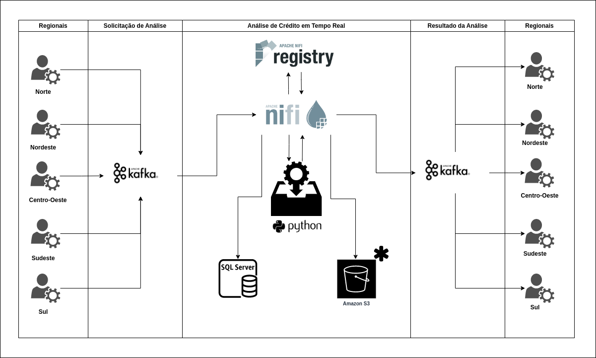

# Análise de crédito em tempo real




### Fazendo o build da imagem que simula as Regionais

```bash
cd Regionais/
```

```bash
docker build -f dockerfile -t base-sistema-regionais:0.0.1 .
```

### Um contâiner para simular cada regional

- Centro_Oeste

```bash
docker run --rm \
  -e REGIAO=Centro_Oeste \
  --name regional-centro-oeste \
  --hostname regional-centro-oeste \
  -p 8881:8888 \
  -d base-sistema-regionais:0.0.1
```

- Nordeste

```bash
docker run --rm \
  -e REGIAO=Nordeste \
  --name regional-nordeste \
  --hostname regional-nordeste \
  -p 8882:8888 \
  -d base-sistema-regionais:0.0.1
```

- Norte

```bash
docker run --rm \
  -e REGIAO=Norte \
  --name regregionaliao-norte \
  --hostname regional-norte \
  -p 8883:8888 \
  -d base-sistema-regionais:0.0.1
```

- Sudeste

```bash
docker run --rm \
  -e REGIAO=Sudeste \
  --name regional-sudeste \
  --hostname regional-sudeste \
  -p 8884:8888 \
  -d base-sistema-regionais:0.0.1
```

- Sul

```bash
docker run --rm \
  -e REGIAO=Sul \
  --name regional-sul \
  --hostname regional-sul \
  -p 8885:8888 \
  -d base-sistema-regionais:0.0.1
```

### Ativando todos os serviços do fluxo

```bash
cd ..
```

```bash
docker-compose -f docker-compose.yaml --compatibility up -d
```


***Em Desenvolvimento...***


https://rmoff.net/2018/08/02/kafka-listeners-explained/

https://hub.docker.com/r/bitnami/kafka


